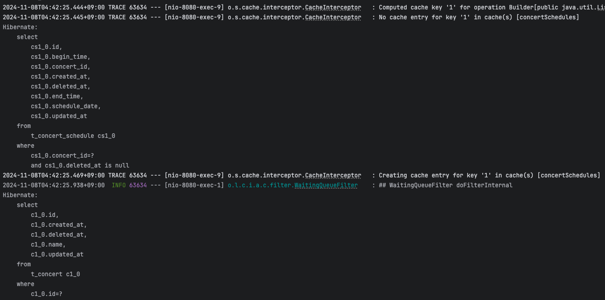
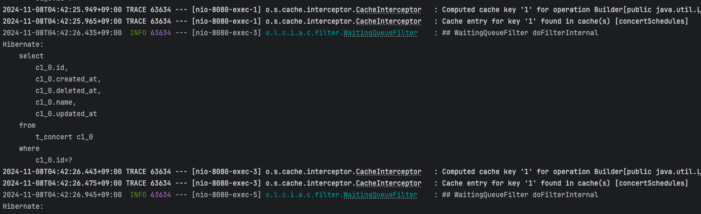
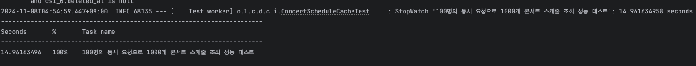
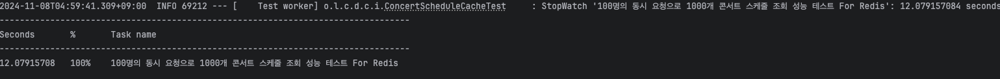
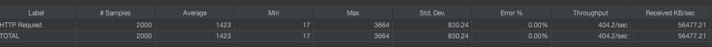
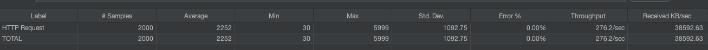

# 콘서트 스케쥴 조회에 대한 Redis 캐시 적용

## 캐시 종류

### local cache
* ``설명``: 애플리케이션 내 메모리에서 관리되는 캐시로, 개별 인스턴스에서만 접근 가능하다.
* ``특징``: 빠른 접근이 가능하지만 분산 환경에서는 일관성 문제 발생한다. 이로 인해 사용자간에 다른 데이터가 보여질 수 있다.
* ``사용 예``: 단일 서버환경에서. 짧은 시간 동안 반복되는 동일 요청에 대한 캐싱을 할 수 있다.

### global cache
* ``설명``: 여러 서버 인스턴스 간에 공유되는 캐시로, 분산환경에서 데이터 일관성 유지를 위해 사용한다.
* ``특징``: 분산 환경에서 일관성 있게 데이터를 제공 가능하다.
* ``사용 예``: 서버 간에 동일한 데이터를 일관성 있게 제공해야 하는 상황에서 사용한다.

## 필요성
* ``성능 향상``: 데이터베이스 조회 비용을 줄여, 서버 응답 속도를 높일 수 있다. 특히 무거운 잡에 대해서 효과적일 수 있다.
* ``부하 감소``: 데이터베이스에 대한 접근 빈도를 줄일 수 있다. 이는 곧 서비스 안정성을 높인다.

### redis cache
키-값 기반으로 데이터를 저장하고, TTL을 통해 자동으로 만료가 가능하다.
* ``장점``: 분산 환경에서 서버 간 데이터 공유가 가능하고, 데이터 일관성을 유지하는 데 유리하다.
* ``사용 예``: 서버 간 동일 데이터를 빠르게 제공해야 할 때 사용하고 캐시를 통해 잘 변하지 않는 데이터를 빠르게 응답해줘야 할 때 사용할 수 있다.

### 캐시 적용 방법
1. @Cacheable 어노테이션
   별도의 cachemanager를 사용하지 않으면 로컬 캐시로 동작하며, 기본적으로 concurrentHashMap으로 관리된다. 첫 번째 조회 시 캐시에 데이터를 저장하고, 이후 조회는 캐시에서 데이터를 가져오게 된다.
2. RedisCacheManager 같은 별도의 캐시 매니저를 등록하면 해당 캐시로 동작하게 된다.

### 적용 포인트
기본적으로 캐시는 잘 변하지 않는 데이터에 대해 적용해야한다. 
콘서트 서비스의 경우 적용포인트를 생각해봤을 때 아래 두가지 케이스에 적용할 수 있을 것 같다.  
* 콘서트 목록 조회
* 콘서트 스케쥴 목록 조회
  캐시 적용 테스트는 스케쥴 목록 조회에 대해 진행했다.

### 적용 테스트 결과
* 첫 번째 조회시 캐시에 없으면 db 조회 후 해당 데이터에 대해 캐시를 저장하고, 이후 조회는 캐시에서 데이터를 가져오게 된다.
* 테스트 코드에서는 redis가 빨랐으나 jmeter에서는 DB가 빨랐는데 jmeter와 test code 환경 차이로 인해 발생한 결과인지 잘 모르겠다. 여러번 돌려봤는데도 동일한 결과를 보이는데 어딘가에 병목이 발생했을 수도 있을 것 같다.

#### 캐시 적용 로그
* 캐시 miss 로그 : no Cache entry for key '1' in cache(s) 'concertSchedules'
  
    

 
* 캐시 hit 로그 : Cache entry for key '1' found in cache(s) 'concertSchedules'
    

------

#### Call test code
* 조건: 1000개의 콘서트 스케쥴 데이터를 100번 조회
  * 캐시 없이 DB 조회 : 14.9sec
    

  * 캐시 적용 : 12.0sec
    

#### Call jmeter
* 조건: 1000개의 콘서트 스케쥴 데이터를 1000명이 2번 루프 조회
    * 캐시 없이 DB 조회 : 402 throughput
      

    * 캐시 적용 : 276 throughput
      
