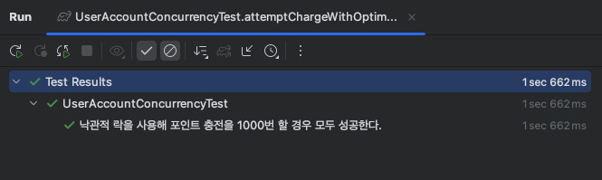
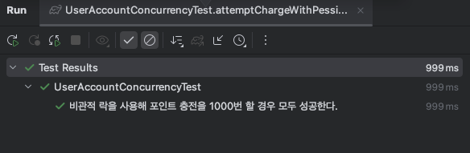
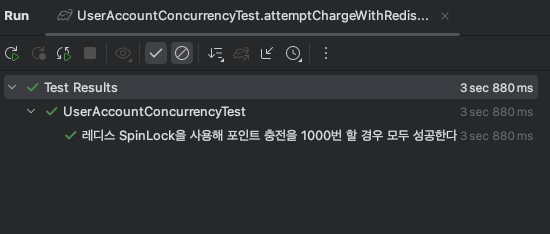
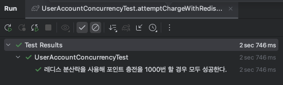

## 동시성 이슈 분석

## 동시성 이슈 발생 지점

### 1. `좌석 예약`

- 1개의 좌석에 대해 N명의 사용자가 예약을 할 때 경합이 발생한다.
- 하나의 좌석에 대해서는 한 건의 예약만 이루어져야한다.

### 2. `포인트 충전/사용`

* 기본적으로 포인트 사용과 충전에 대해서는 모든 요청이 반영되어야한다고 가정한다.
* 다만 1명의 사용자가 동시에 포인트 충전이 여러번 발생할 수 있다.

* 만약 한 건만 충전/사용 되도록 처리되어야한다면..?
    * 이러한 경우는 충돌이 빈번하지 않다는 가정하에 낙관적 락으로 유저 포인트를 조회하여 갱신 처리할 것 같다.
    * 다만 이러한 경우에 대해 다음과 같은 방법을 고민해보고 구현 방법을 찾아봤다.
        * API Rate Limiting 라이브러리
            * https://www.baeldung.com/spring-bucket4j
            * Redis에 특정 api 요청에 대한 값을 관리할 수 있는 정보를 저장 후 참조


## 동시성 제어 방법

### 관계형 데이터베이스 레벨에서 제어방법

*  낙관적 락(Optimistic Lock): **데이터베이스 논리적 잠금 기법** 이다.
    * `방식` : 데이터의 버전 컬럼을 통해 데이터를 업데이트 할 때 충돌 여부를 확인한다. Spring을 사용하면 `ObjectOptimisticLockingFailureException`을 발생시키므로 이를 확인하여 처리할 수 있다.
    * `사용시점`: 충돌이 적게 발생할 것으로 예상할 때 사용한다.
    * `장점`: 해당 자원에 대해 실제로 잠금을 거는 것이 아니기 때문에 비관적 락에 비해 성능이 좋다.
    * `단점`: 충돌이 발생할 때 재시도 로직을 추가해야한다.
    * `구현`: 기본적으로 JPA 엔티티에 version 어노테이션이 붙은 컬럼을 선언하는 것을 필수다. 추가적으로 repo에서 명시적으로 Lock어노테이션을 붙여서 특정 메서드가 락을 사용한 것인지 명시적으로 나타내기도 한다.

```java
@Entity
@Table(name = "t_concert_seat")
public class ConcertSeat {  
  
    @Id  
    @GeneratedValue(strategy = GenerationType.IDENTITY)  
    @Column(name = "id")  
    private Long seatId;  

    // 중략
  
    @Version  
    private Long version;

}

// repo에서 명시적으로 선언해줘도 된다.

public interface ConcertSeatJpaRepository extends JpaRepository<ConcertSeat, Long> {  
  
    @Lock(LockModeType.OPTIMISTIC)  
    @Query("" +  
            " select cs" +  
            " from ConcertSeat cs" +  
            " where cs.seatId =:seatId")  
    Optional<ConcertSeat> findByIdWithLock(@Param("seatId") Long seatId);  
}
```

* 비관적 락(Pessimistic Lock): **데이터베이스 물리적 잠금 기법** 이다.
    * `방식` : 데이터를 읽거나 수정할 때 해당 데이터 row에 대해 물리적인 락을 걸어 다른 트랜잭션의 접근을 차단한다.
    * `사용시점`: 충돌이 자주 발생하는데 모든 요청이 성공해야할 경우에 사용한다.
    * `장점`: 이미 락이 점유되어 있으면 다른 스레드는 해당 락을 획득할 때까지 대기하므로 충돌을 사전에 방지할 수 있다.
    * `단점`: 다른 스레드가 락을 획득할 때까지 대기해야하므로 애플리케이션 성능이슈가 있을 수 있다.
    * `구현`: repo에서 명시적으로 Lock어노테이션에 타입을 PESSIMISTIC_WRITE 을 붙여서 사용한다.

``` java
    @Lock(LockModeType.PESSIMISTIC_WRITE)  
    @Query("" +  
            " select cs" +  
            " from ConcertSeat cs" +  
            " where cs.seatId =:seatId")  
    Optional<ConcertSeat> findByIdWithLock(@Param("seatId") Long seatId);
    
    
    @Component
    public class ConcertFacade {
    
        @Transactional  
        public ConcertInfo.ReservationInfo reserveConcertSeat(Long seatId, Long userId) {  
            User user = userService.getUser(userId);  
        
            // 비관적 락으로 좌석 조회
            ConcertSeat seat = concertSeatService.getConcertSeatWithLock(new ConcertSeatQuery.Search(seatId));
        
            // 동시 예약 요청시 락을 획득한 스레드가 update가 발생하고 lock이 해제되면
            // 다른 스레드들이 해당 좌석을 조회시 예약 불가한 상태이므로 예외가 발생
            // 이후 로직이 실행이 되지 않는다. 
            seat.checkReservableSeat(LocalDateTime.now(), ConcertPolicy.TEMP_RESERVED_SEAT_MINUTES);  
            
            seat.reserveSeatTemporarily(LocalDateTime.now());  
          
            ConcertReservation reservation = concertReservationService.createConcertReservation(new ConcertReservationCommand.Create(seat.getSeatId(),  
                                                                                 
        }
    }
```

#### 성능 비교

포인트 충전
* 1000회 시도가 모두 성공해야한다.
* 낙관적 락을 이용할 경우 충돌이 발생할 때 재시도를 한다.
* 재시도 횟수는 30번으로 설정한다.

#### 1) 낙관적 락을 이용한 포인트 충전

```java
@DisplayName("낙관적 락을 사용해 포인트 충전을 1000번 할 경우 모두 성공한다.")  
@Test  
void attemptChargeWithOptimisticLock100Times() throws InterruptedException {  
    Long userId = 1L;  
    long balance = 100;  
    long chargeAmount = 1000;  
    int chargeCount = 1000;  
  
    UserAccount account = userAccountJpaRepository.save(UserAccount.builder()  
                                                                   .userId(userId)  
                                                                   .balance(balance)  
                                                                   .build());  
    ExecutorService executorService = Executors.newFixedThreadPool(chargeCount);  
    CountDownLatch latch = new CountDownLatch(chargeCount);  
  
    AtomicInteger success = new AtomicInteger(0);  
    AtomicInteger failed = new AtomicInteger(0);  
  
    for (int i = 0; i < chargeCount; i++) {  
        executorService.submit(() -> {  
            int maxRetries = 30;  
            int retryCount = 0;  
            boolean isCharged = false;  
  
            while (retryCount < maxRetries && !isCharged) {  
                try {  
                    accountService.chargeBalance(new UserAccountCommand.Action(userId, chargeAmount));  
                    success.incrementAndGet();  
                    isCharged = true;  
                } catch (ObjectOptimisticLockingFailureException oe) {  
                    retryCount++;  
                    log.warn("## retry attempt:[{}]", retryCount);  
                } catch (Exception e) {  
                    log.warn("## charge error:[{}]", e.getClass().getSimpleName(), e);  
                    failed.incrementAndGet();  
                    break;  
                }  
            }  
            latch.countDown();  
        });  
    }  
    latch.await();  
    executorService.shutdown();  
  
    // then  
    assertThat(success.get()).isEqualTo(100);  
    UserAccount userAccount = accountService.getUserAccount(userId);  
    assertThat(userAccount.getBalance()).isEqualTo(balance + chargeAmount * success.get());  
}
```

* 소요 시간: 1sec 662ms
* 최대 재시도 횟수: 18회
  


#### 2) 비관적 락을 이용한 포인트 충전

```java
@DisplayName("비관적 락을 사용해 포인트 충전을 1000번 할 경우 모두 성공한다.")  
@Test  
void attemptChargeWithPessimisticLock100Times() throws InterruptedException {  
    Long userId = 1L;  
    long balance = 100;  
    long chargeAmount = 1000;  
    int chargeCount = 1000;  
  
    UserAccount account = userAccountJpaRepository.save(UserAccount.builder()  
                                                                   .userId(userId)  
                                                                   .balance(balance)  
                                                                   .build());  
    ExecutorService executorService = Executors.newFixedThreadPool(chargeCount);  
    CountDownLatch latch = new CountDownLatch(chargeCount);  
  
    AtomicInteger success = new AtomicInteger(0);  
    AtomicInteger failed = new AtomicInteger(0);  
  
    for (int i = 0; i < chargeCount; i++) {  
        executorService.submit(() -> {  
            try {  
                accountService.chargeBalanceWithLock(new UserAccountCommand.Action(userId, chargeAmount));  
                success.incrementAndGet();  
            } catch (Exception e) {  
                log.warn("## charge error:[{}]", e.getClass().getSimpleName(), e);  
                failed.incrementAndGet();  
            } finally {  
                latch.countDown();  
            }  
        });  
    }  
    latch.await();  
    executorService.shutdown();  
  
    // then  
    assertThat(success.get()).isEqualTo(1000);  
    UserAccount userAccount = accountService.getUserAccount(userId);  
    assertThat(userAccount.getBalance()).isEqualTo(balance + chargeAmount * success.get());  
}
```
* 소요 시간: 999ms
  

### 테스트 결과
* 근소하지만 비관적 락이 더 짧은 소요시간을 나타냈다.
* 낙관적 락을 사용할 경우 스레드를 증가시킬 수록 재시도 횟수도 늘려야지 테스트를 통과할 수 있었다.
    * 얼마나 재시도가 필요한지 파악할 수 없었다(각 테스트 실행시마다 최대 재시도횟수가 천차만별로 나왔다)


### 결론
* **사용하는 목적에 따라 락을 적절하게 선택해야할 것 같다.**
    * 낙관적 락은 데이터베이스에 물리적인 락을 걸지 않아서 데이터 정합성을 보장할 때 비관적 락보다 가벼울 수 있다고 생각했다. 그러나 많은 충돌이 발생한다면 잦은 재시도 로직으로 인해  db pool에 있는 connection이 고갈될 수 있으니 낮은 재시도로직 이후에는 예외처리를 해서 db 부담을 줄이는 추가적인 조치가 필요할 것 같다고 생각이 들었다.

    * 비관적 락의 경우 정합성은 확실히 보장되나 데이터베이스에 lock을 거는 행위 자체가 성능 저하를 야기해 다른 db 자원에 접근할 때 이슈가 생길 수 있을 것 같았다. 또한 연관관계가 맺어있을 때 자칫 동시에 트랜잭션이 들어올 경우 서로 자원을 획득하려고 대기하는 데드락을 유발할 수 있다는 글도 봤다.

----

### 관계형 데이터베이스 레벨이 아닌 동시성 제어 기법

위 방식은 DB 성능이슈를 제외해도 큰 문제가 있다. 바로 분산환경에서의 Lock이 제한이 있다는 점이다.
N개의 애플리케이션이 1개의 DB를 바라보면 락이 적용된다. 그러나 여러개의 DB 서버가 있고 각 DB에서 공통된 자원을 조회, 수정할 경우 락은 각각의 서버에서 따로 적용되기 때문에 마찬가지로 동시성으로 인한 이슈가 발생할 수 있다. 이러한 문제로 인해 요즘은 Redis나 Kafka를 이용해 분산환경에서 효과적으로 동시성을 제어할 수 있다고 한다.


### redis

#### 개요
* Redis는 메모리 기반의 key-value 저장소로서 데이터를 메모리에 저장하고 빠르게 조회할 수 있는 기능을 제공한다.
* Redis의 SETNX 명령어를 이용하면 키가 존재하지 않을 경우에만 값을 설정할 수 있으므로 이를 통해 동시성을 제어할 수 있다.

#### 방식
* simple Lock   
      * `방식` : SETNX 명령어를 이용해 키가 존재하지 않을 경우에만 값을 설정
      * `장점` : 구현이 간단하다.
      * `단점` : 별도의 TTL 설정이 없거나 장애 발생 시 레디스에 해당 키가 영구적으로 남아있을 수 있고 락 획득에 실패할 경우 재시도 로직을 추가해야한다.
      * `구현`:
```java
@Repository
@RequiredArgsConstructor
public class RedisRepository{
    private final RedisTemplate<String, Object> redisTemplate;

    public Boolean setIfAbsent(String key, String value, Long leaseTime, TimeUnit timeUnit){
        return redisTemplate.opsForValue().setIfAbsent(key, value, leaseTime, timeUnit);
    }

    public Boolean delete(String key){
        return redisTemplate.delete(key);
    }
}

@Repository
@RequiredArgsConstructor
public class RedisSimpleLockRepository implements LockRepository {
    private final RedisRepository redisRepository;

    @Override
    public Boolean tryLock(String lockKey, String value, Long leaseTime, TimeUnit timeUnit) {
        return redisRepository.setIfAbsent(lockKey, value, leaseTime, timeUnit);
    }

    @Override
    public Boolean unlock(String lockKey) {
        return redisRepository.delete(lockKey);
    }
}

```

* spin Lock   
  * `방식` : 스핀 락은 락이 해제될 때까지 Redis에 반복적으로 SETNX 명령을 호출하여 락을 얻는 방식이다. 기존 simple 락에 재시도 조건이나 타임아웃 조건을 추가해 락 획득에 대해 재시도로직을 구현한다.
  * `장점` : 락 획득을 재시도하므로 어느정도의 회복 동작이 가능하다.
  * `단점` : 레디스에 락 획득에 대해 지속적으로 요청을 보내므로 레디스에 부하를 줄 수 있다. 락 획득에 대해 레디스 및 애플리케이션에서 속도를 조절해야하므로 성능 이슈 및 비효율적일 수 있다.
  * `구현`:
```java
@Slf4j
@Repository
@RequiredArgsConstructor
public class RedisSpinLockRepository implements LockRepository {
    private final RedisRepository redisRepository;

    @Override
    public Boolean tryLock(String lockKey, String value, Long leaseTime, TimeUnit timeUnit) {
        while (true) {
            if (redisRepository.setIfAbsent(lockKey, value, leaseTime, timeUnit)) {
                return true;
            }
            try {
                Thread.sleep(LockType.SPIN_LOCK.getWaitTime());
            } catch (InterruptedException e) {
                Thread.currentThread().interrupt();
                return false;
            }
        }
    }
}
```

* RLock(Redisson Lock)
    * `방식` : redis를 이용한 분산락 java 라이브러리이며 RLock을 사용하면 Redis의 Pub/Sub 기능을 이용해 락을 관리할 수 있고 위 두 방식에 비해 비교적 안정적이다.
    * `장점` : 락 획득을 재시도하므로 어느정도의 회복 동작이 가능하다.
    * `단점` : 기존 redis 설정에 Redisson 설정이 필요하다.
    * `구현`:
```java
@Slf4j
@Repository
@RequiredArgsConstructor
public class RedisRLockRepository implements LockRepository {
    private final RedisRepository redisRepository;

    @Override
    public Boolean tryLock(String lockKey, String value, Long waitTime, Long leaseTime, TimeUnit timeUnit) {
        try {
            return redisRepository.getLock(lockKey)
                                  .tryLock(leaseTime, waitTime, timeUnit);
        } catch (InterruptedException e) {
            log.error("## Failed to RLock acquirement", e);
            return false;
        }
    }

    @Override
    public Boolean unlock(String lockKey) {
        redisRepository.unlock(lockKey);
        return true;
    }
}
```

#### 3) Redis를 이용한 포인트 충전 동시성 테스트
낙관적, 비관적 락과 동일한 조건에서 Redis를 이용한 동시성 테스트를 진행했다.

```java
@DisplayName("레디스 SpinLock을 사용해 포인트 충전을 1000번 할 경우 모두 성공한다.")
    @Test
    void attemptChargeWithRedisSpinLock1000Times() throws InterruptedException {
        Long userId = 1L;
        long balance = 100;
        long chargeAmount = 1000;
        int chargeCount = 1000;

        UserAccount account = userAccountJpaRepository.save(UserAccount.builder()
                                                                       .userId(userId)
                                                                       .balance(balance)
                                                                       .build());
        ExecutorService executorService = Executors.newFixedThreadPool(chargeCount);
        CountDownLatch latch = new CountDownLatch(chargeCount);

        AtomicInteger success = new AtomicInteger(0);
        AtomicInteger failed = new AtomicInteger(0);

        for (int i = 0; i < chargeCount; i++) {
            executorService.submit(() -> {
                String lockKey = "user:account:" + userId;
                try {
                    Boolean lock = spinLockRepository.tryLock(lockKey, "", 200L, TimeUnit.MILLISECONDS);
                    if (lock) {
                        accountService.chargeBalance(new UserAccountCommand.Action(userId, chargeAmount));
                        success.incrementAndGet();
                    }
                } catch (Exception e) {
                    log.warn("## charge error:[{}]", e.getClass().getSimpleName(), e);
                    failed.incrementAndGet();
                } finally {
                    simpleLockRepository.unlock(lockKey);
                    latch.countDown();
                }
            });
        }
        latch.await();
        executorService.shutdown();

        // then
        assertThat(success.get()).isEqualTo(1000);
        UserAccount userAccount = accountService.getUserAccount(userId);
        assertThat(userAccount.getBalance()).isEqualTo(balance + chargeAmount * success.get());
    }
```
* 소요 시간: 3sec 346ms
  

낙관적, 비관적 락을 사용할 때보다 더 많은 시간이 걸렸다. 그 이유는 redis에 부하를 주는 것을 완화하고자
락 대기시간을 통해 해당 스레드가 재요청하는 것을 제어하다보니 발생한 것으로 보인다.
또한 leaseTime와 waitingTime에 대해 적절하게 조절하지 못하면 테스트에 지속적으로 실패했었는데
락이 먼저 자동으로 해제되어 다른 스레드가 락을 획득하려고 하면서 데이터 정합성이 깨지거나 하는 문제가 나타났기 때문이다.


```java
@DisplayName("레디스 분산락을 사용해 포인트 충전을 1000번 할 경우 모두 성공한다.")
    @Test
    void attemptChargeWithRedisRLock1000Times() throws InterruptedException {
        Long userId = 1L;
        long balance = 100;
        long chargeAmount = 1000;
        int chargeCount = 1000;

        UserAccount account = userAccountJpaRepository.save(UserAccount.builder()
                                                                       .userId(userId)
                                                                       .balance(balance)
                                                                       .build());
        ExecutorService executorService = Executors.newFixedThreadPool(chargeCount);
        CountDownLatch latch = new CountDownLatch(chargeCount);

        AtomicInteger success = new AtomicInteger(0);
        AtomicInteger failed = new AtomicInteger(0);

        for (int i = 0; i < chargeCount; i++) {
            executorService.submit(() -> {
                String lockKey = "user:account:" + userId;
                Boolean lock = false;
                try {
                    lock = rLockRepository.tryLock(lockKey, "", 5000L, 3000L, TimeUnit.MILLISECONDS);
                    if (lock) {
                        accountService.chargeBalance(new UserAccountCommand.Action(userId, chargeAmount));
                        success.incrementAndGet();
                    }
                } catch (Exception e) {
                    log.warn("## charge error:[{}]", e.getClass().getSimpleName(), e);
                    failed.incrementAndGet();
                } finally {
                    if (lock) {
                        rLockRepository.unlock(lockKey);
                    }
                    latch.countDown();
                }
            });
        }
        latch.await();
        executorService.shutdown();

        // then
        assertThat(success.get()).isEqualTo(1000);
        UserAccount userAccount = accountService.getUserAccount(userId);
        assertThat(userAccount.getBalance()).isEqualTo(balance + chargeAmount * success.get());
    }

```
* 소요 시간: 2sec 746ms
  


spin Lock 보다는 시간이 적게 걸렸는데 자체적으로 루프를 돌아서 락을 획득하는 것보다 Redisson Lock을 락이 해제가 되면 redis에서 subscribe가 되어
대기 중 바로바로 락을 획득할 수 있어 상대적으로 락을 획득하는 시간이 짧아진 것으로 보인다. 마찬가지로 낙관적, 비관적 락에 비해 소요시간이 더 걸렸다.


### 결론
* **Redis를 이용한 락을 사용하면 DB 서버에 부하를 줄이고 비교적 안전하게 락 획득이 가능하다.**
    * 락을 획득하는 시간이 너무 짧으면 락을 획득하지 못하고 너무 길면 락을 획득하는 시간이 길어져 성능 이슈가 발생할 수 있다.
    * 그러기 위해서 leaseTime과 waitingTime을 적절하게 조절해야한다.
    * 락을 획득하는 시간을 적절하게 조절하지 못하면 락이 먼저 자동으로 해제되어 다른 스레드가 락을 획득하려고 하면서 데이터 정합성이 깨지거나 하는 문제가 나타날 수 있다.

---

### kafka
Kafka를 이용하면 queue의 특성을 활용한 순서 보장을 통해 동시에 특정 자원에 접근할 때 자원에 대해 제어를 할 수 있다고 한다.
Kafka의 파티셔닝 및 메시지 오프셋 관리 기능을 통해 **동일한 메시지를 하나의 컨슈머가 처리하게 하여** 이를 제어할 수 있다.
실제로 구현을 해보지는 못했고 용어나 동시성 제어 방법에 대해 알아보았다.

#### 개념
1) 토픽 및 파티션  
   * 데이터를 토픽으로 분류하고, 각 토픽에 대해 하나 이상의 파티션을 생성하여 데이터를 저장한다.
   * 각 파티션이 순서 보장 단위로서 동작한다. 특정 자원에 대한 요청이 온다면 동일한 파티션을 통과하도록 설정하면서 동시성을 제어할 수 있다.

2) 컨슈머 및 오프셋
   - 컨슈머는 특정 파티션과 1대1 관계이다.
   - 컨슈머는 오프셋(offset) 기반으로 자신이 처리한 위치를 기록하고, 이를 통해 중복 처리를 방지하고 메시지를 순차처리할 수 있다.


