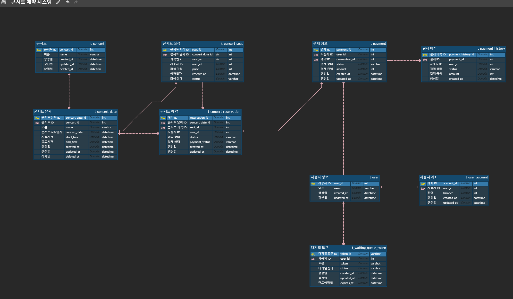

## 콘서트 도메인

- **Concert** (콘서트 정보를 담는 테이블)
    - `concert_id` (PK): 콘서트 고유 ID
    - `name`: 콘서트 이름
    - `created_at`: 생성 시간
    - `updated_at`: 갱신 시간
    - `deleted_at`: 삭제 시간

- **ConcertDate** (콘서트 날짜 정보를 담는 테이블)
    - `concert_date_id` (PK): 콘서트 날짜 고유 ID
    - `concert_id` (FK): 콘서트 ID (Concert 테이블의 FK)
    - `concert_date`: 콘서트가 열리는 날짜
    - `start_time`: 콘서트 시작 시간
    - `end_time`: 콘서트 종료 시간
    - `created_at`: 생성 시간
    - `updated_at`: 갱신 시간
    - `deleted_at`: 삭제 시간

- **concertSeat** (좌석 정보를 담는 테이블)
    - `seat_id` (PK): 좌석 고유 ID
    - `concert_date_id` (FK): 콘서트 날짜 ID (ConcertDate 테이블의 PK)
    - `user_id` (FK): 사용자 고유 ID (User 테이블의 PK)
    - `seat_no`: 좌석 번호 (예: 1번, 2번)
    - `price`: 좌석 가격
    - `reserved_at`: 예약 시간
    - `status`: 좌석 상태

* **concertReservation** (콘서트 예약 정보 테이블)
    - `reservation_id` (PK): 예약 고유 ID
    - `concert_date_id` (FK): 콘서트 날짜 ID (ConcertDate 테이블의 PK)
    - `seat_id` (FK): 좌석 ID (ConcertSeat 테이블의 PK)
    - `user_id` : 사용자 ID
    - `status`: 예약 상태 (예: 예약, 취소)
    - `payment_status`: 결제 상태 (예: 결제 완료, 결제 대기)
    - `created_at`: 생성 시각
    - `updated_at`: 갱신 시간

---
## 사용자 도메인

- **User** (사용자 정보 테이블)
    - `user_id` (PK): 사용자 고유 ID
    - `name`: 사용자 이름
    - `created_at`: 등록일
    - `updated_at`: 갱신일

- **UserAccount** (계좌 정보 테이블)
    - `account_id` (PK): 계좌 고유 ID
    - `user_id` (FK): 사용자 ID (User 테이블의 FK)
    - `balance`: 계좌 잔액
    - `created_at`: 계좌 생성일
    - `updated_at`: 계좌 정보 갱신일

---
## 결제 도메인

- **Payment** (결제 정보 테이블)
    - `payment_id` (PK): 결제 고유 ID
    - `reservation_id` (FK): 예약 ID (Reservation 테이블의 PK)
    - `status`: 결제 상태 (예: 결제 완료, 결제 취소)
    - `total_amount`: 결제 금액
    - `created_at`: 결제 요청 시간
    - `updated_at`: 결제 갱신 시간

- **PaymentHistory** (결제 이력 테이블)
    - `payment_history_id` (PK): 결제 이력 고유 ID
    - `payment_id` (FK): 결제 ID (Payment 테이블의 PK)
    - `user_id`: 사용자 ID
    - `status`: 결제 상태 변화 (예: 결제 완료, 결제 취소)
    - `amount`: 결제 금액
    - `created_at`: 상태 변경 발생 시간

---
## 대기열 토큰 도메인

* **WaitingQueueToken** (대기열 토큰 테이블)
- `token_id` (PK): 대기열 토큰 고유 ID
- `token`: 대기열 토큰
- `user_id` (FK): 사용자 ID (User 테이블의 PK)
- `status`: 대기열 상태 (예: 대기 중, 입장 가능, 만료)
- `created_at`: 토큰 생성 시간
- `updated_at`: 갱신 시간
- `expires_at`: 토큰 만료 예정 시간

## ERD

