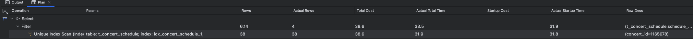

# 콘서트 예약 시스템 인덱스 적용 보고서

---

## 테스트 환경
* DB: AWS RDS MYSQL 8
    * cpu: 2 core
    * memory: 1gb
    * version: 8.0.39
* 분석도구: DataGrip
* 대상 쿼리에 대해 ``no index``, ``단일 인덱스``, ``복합 인덱스``일 때 ``쿼리 실행 계획(explain)`` 및 ``실제 실행 결과(explain analyze)``를 분석함

---

## 인덱스 적용 대상 테이블

### 1. 콘서트

* ### **이유**
  * 콘서트를 예약할 때 콘서트 정보부터 조회해야할 것이다.
  * 나중에 예약 정보, 이력 정보 등의 콘서트 메타데이터를 정보를 보여줘야할 때 많이 사용될 것이다.

  * ### **설정**
      * **총 rows**: 6,590,000개
      * **대상 컬럼**
        * name: 특정 콘서트를 찾을 때 이름을 통해 검색할 것이다.
        * opened_at:  특정 일자의 콘서트를 찾기 위해서는 날짜 필터가 필요할 것이다.
      * **분포도**
          * 콘서트 이름과 날짜에 대한 어느정도의 분포도 설정을 위해 다음과 같이 조건을 설정했다.
      
        ```sql
            select name, count(*)
            from t_concert
            group by name;
        ```
  
         <details>
         <summary>더보기</summary>
          
        
          * opened_at의 결우 2024-11-12~2025-03-31 사이의 데이터를 랜덤으로 생성함.
          * 대부분 콘서트는 1년 365일 랜덤한 날짜에 열리는게 아니라 특정 기간에 몰려있다. 
            * ex) 아이브_콘서트: 2025-01-01 ~ 2025-01-15
         </details>
    
* ### **대상 쿼리 분석**

```sql
select *
from t_concert
where name = '아이브_콘서트'
and opened_at between '2025-01-01' and '2025-01-15';
```


* ### case 1. 인덱스가 없는 경우
  <details>
  <summary>더보기</summary>

  | id | select_type | table     | partitions | type | possible_keys | key | key_len | ref | rows    | filtered | Extra       |
  |----|-------------|-----------|------------|------|---------------|-----|---------|-----|---------|----------|-------------|
  | 1  | SIMPLE      | t_concert | null       | ALL  | null          | null | null    | null| 6388566 | 1.11     | Using where |

  * ``explain``
    * 콘서트 테이블의 모든 데이터를 조회해야 하기 때문에 풀 스캔이 발생할 것으로 예상
      * filtered된 row가 1.11%로 매우 낮기 때문에 대부분의 데이터를 그대로 읽을 것이다.   
      <br/>
  * ``explain analyze``      

    
    
    
    <br/>
    
    * ``소요시간``: 18576ms
        * full scan: 16953ms
        * filter: 1623ms
    * ``cost``: 661402
  </details>


* ### case 2. 단일 인덱스가 있는 경우
  <details>
  <summary>더보기</summary>

    | id | select_type | table     | partitions | type | possible_keys         | key          | key_len | ref   | rows   | filtered | Extra         |
    |----|-------------|-----------|------------|------|-----------------------|--------------|---------|-------|--------|----------|---------------|
    | 1  | SIMPLE      | t_concert | <null>     | ref  | idx_concert_1, idx_concert_2 | idx_concert_1 | 1023    | const | 508434 | 33.02     | Using where   |

  * ``explain``
    * name, opened_at 컬럼에 대해 각각 인덱스를 생성했을 때, name 컬럼에 대한 인덱스(idx_concert_1)를 사용할 것으로 예상
    * filtered된 row가 33.02%로 높아졌다.   
    <br/>
  * ``explain analyze``   
  
    
       
    <br/>
    실제로 쿼리가 실행된 결과를 분석해보면 다음과 같다.
      * ``소요시간``: 6141ms
          * index scan: 5913ms
          * filter: 6141ms
      * ``cost``: 118428
      * ``index``: idx_concert_1   
  
     **풀 스캔에 비해 약 3배 정도 단축되었다.**
  </details>

* ### case 3. 복합 인덱스일 경우 

  <details>
  <summary>더보기</summary>

  | id | select\_type | table | partitions | type | possible\_keys | key | key\_len | ref | rows | filtered | Extra |
  | :--- | :--- | :--- | :--- | :--- | :--- | :--- | :--- | :--- | :--- | :--- | :--- |
  | 1 | SIMPLE | t\_concert | null | range | idx\_concert\_2,idx\_concert\_1,idx\_concert\_3 | idx\_concert\_3 | 1029 | null | 55440 | 100 | Using index condition; Using MRR |

  * ``explain``
      * name, opened_at 컬럼에 대해 복합 인덱스(idx_concert_3)를 사용할 것으로 예상
      * filtered된 row가 100%로 인덱스 만으로 모든 데이터가 필터링 될 것으로 예상   
    <br/>
  * ``explain analyze``       
  
    
    
   <br/>
  
  * 실제로 쿼리가 실행된 결과를 분석해보면 다음과 같다.
      * ``소요시간``: 342ms
          * index scan: 342ms
      * ``cost``: 56034
      * ``index``: idx_concert_3   
    <br/>
    **복합 인덱스를 사용했을 때, 풀 스캔에 비해 약 50배, 단일 인덱스에 비해 약 18배 정도 단축되었다.**
  </details>

------------------------

### 2. 콘서트 스케쥴 

* ### **이유**
    * 콘서트를 조회한 뒤 해당 콘서트가 열리는 스케쥴 정보를 조회하는 경우가 빈번할 것이다.

* **대상 컬럼**
    * concert_id: 특정 콘서트에 대해 스케쥴을 조회하기 위해 사용
    * opened_at:  특정 일자에 열리는 스케쥴을 찾기 위해서 마찬가지로 날짜 필터가 필요

* ### **설정**
    * 총 rows: 10,000,000개
    * 분포도
        * 콘서트 id에 대한 콘서트 스케쥴 분포도에 대해 대량 119만건의 concert_id에 대한 스케쥴이 존재하는 것으로 가정
  
      ```sql
        select concert_id, count(*)
        from t_concert_schedule
        group by concert_id;
        ```
      <details>
         <summary>더보기</summary>

      
      </details>
    
* ### **대상 쿼리 분석**

```sql
select *  
from t_concert_schedule  
where concert_id = 1165678  
and schedule_date between '2025~01-10' and '2025-01-20';
```

* ### case 1. 인덱스가 없는 경우
  <details>
     <summary>더보기</summary>

   | id | select_type | table              | partitions | type | possible_keys | key | key_len | ref | rows    | filtered | Extra         |
   |----|-------------|--------------------|------------|------|---------------|-----|---------|-----|---------|----------|---------------|
   | 1  | SIMPLE      | t_concert_schedule | <null>     | ALL  | <null>        | <null> | <null>  | <null> | 9559569 | 10       | Using where   |

    * ``explain``
       * 인덱스가 없으므로 풀 스캔이 발생할 것으로 예상    
      <br/>
    * ``explain analyze``             
       
       
       
    <br/>
    실제로 쿼리가 실행된 결과를 분석해보면 다음과 같다.
    
    * ``소요시간``: 11318ms
      * full scan: 10707ms
      * filter: 611ms
    * ``cost``: 982911
  
  </details>
  

* ### case 2. 단일 인덱스가 있는 경우

   <details>
     <summary>더보기</summary>

   | id | select_type | table              | partitions | type | possible_keys                 | key                    | key_len | ref   | rows | filtered | Extra         |
   |----|-------------|--------------------|------------|------|-------------------------------|------------------------|---------|-------|------|----------|---------------|
   | 1  | SIMPLE      | t_concert_schedule | <null>     | ref  | idx_concert_schedule_1, idx_concert_schedule_2 | idx_concert_schedule_1 | 8       | const | 38   | 16.17    | Using where   |

  * ``explain``
      * concert_id 컬럼에 대해 인덱스(idx_concert_schedule_1)를 사용할 것으로 예상
      * filtered된 row가 16.17%로 소폭 높아졌다.    

  * ``explain analyze``      
    
    
    
    <br/>
    실제로 쿼리가 실행된 결과를 분석해보면 다음과 같다.
      * ``소요시간``: 33.5ms
          * index scan: 31.9ms
          * filter: 1.6ms
      * ``cost``: 38.6
      * ``index``: idx_concert_schedule_1
      * **풀 스캔에 비해 약 338배 정도 단축되었다.**
      * **각 concert_id에 대한 카디널리티가 상대적으로 높고 데이터가 소량이라 인덱스를 사용했을 때 효과적인 것으로 보인다.**

    </details>
    
    
  * ### case 3. 복합 인덱스일 경우
    <details>
    <summary>더보기</summary>
    
    | id | select\_type | table | partitions | type | possible\_keys | key | key\_len | ref | rows | filtered | Extra |
    | :--- | :--- | :--- | :--- | :--- | :--- | :--- | :--- | :--- | :--- | :--- | :--- |
    | 1 | SIMPLE | t\_concert\_schedule | null | range | idx\_concert\_schedule\_1,idx\_concert\_schedule\_2,idx\_concert\_schedule\_3 | idx\_concert\_schedule\_3 | 14 | null | 4 | 100 | Using index condition |
    
    * ``explain``
        * name, opened_at 컬럼에 대해 복합 인덱스(idx_concert_3)를 사용할 것으로 예상
        * filtered된 row가 100%로 인덱스 만으로 모든 데이터가 필터링 될 것으로 예상    
      <br/>
    * ``explain analyze``       
       
       
       
    <br/>
    실제로 쿼리가 실행된 결과를 분석해보면 다음과 같다.

    * ``소요시간``: 10.5ms
      * index scan: 10.5ms
      * ``cost``: 5.81
      * ``index``: idx_concert_schedule_3
      * **복합 인덱스를 사용했을 때, 풀 스캔에 비해 약 1079배, 단일 인덱스에 비해 약 3배 정도 단축되었다.**
    </details>

------------------------
## 결론

* 두 대상 테이블 모두 인덱스를 사용했을 때 더 빠른 속도로 쿼리를 수행할 수 있었다.
* 또한 복합 인덱스를 사용했을 때, 단일 인덱스에 비해 더 효과적이었다.


* **콘서트 테이블**

| 인덱스 종류       | 소요 시간 (ms) | 단축된 시간 (ms) | 단축률 (%) |
|-------------------|---------------|-------------------|------------|
| 인덱스 없음       | 18576         | -                 | -          |
| 단일 인덱스       | 6141          | 12435            | 66.94%     |
| 복합 인덱스       | 342           | 18234            | 98.16%     |

* 단일 인덱스를 사용했을 때, 풀 스캔에 비해 약 3배 정도 단축되었다.
* 복합 인덱스를 사용했을 때, 단일 인덱스에 비해 약 18배 정도 단축되었다.
* 최종적으로 풀 스캔에 비해 약 50배 정도 단축되었다.


* **콘서트 스케쥴 테이블**

| 인덱스 종류       | 소요 시간 (ms) | 단축된 시간 (ms) | 단축률 (%) |
|-------------------|---------------|-------------------|------------|
| 인덱스 없음       | 11318         | -                 | -          |
| 단일 인덱스       | 33.5          | 11284.5          | 99.70%     |
| 복합 인덱스       | 10.5          | 11307.5          | 99.91%     |

* 콘서트 스케쥴 테이블의 경우, 단일 인덱스만으로도 인덱스가 없을 때보다 더 빠른 속도로 쿼리를 수행할 수 있었다. 다만 복합 인덱스를 사용했을 때 더 빠른 속도로 쿼리를 수행할 수 있었다.
  * 단일 인덱스를 사용했을 때, 풀 스캔에 비해 약 338배 정도 단축되었다.
  * 복합 인덱스를 사용했을 때, 단일 인덱스에 비해 약 3배 정도 단축되었다.
  * 최종적으로 풀 스캔에 비해 약 1079배 정도 단축되었다.


------------------------
## 총평

* **장점**:
  * ``조회 성능 개선``
    * 인덱스를 적용하면 풀 스캔에 비해 더 빠른 속도로 쿼리를 수행할 수 있다.
    * order by 등을 사용할 때 정렬된 인덱스를 사용할 경우 더 빠른 속도로 정렬할 수 있다.
    * unique 인덱스를 사용할 경우 중복 데이터를 방지할 수 있다.
* **단점**:
  * ``조회 이외 작업 성능 저하``
    * 데이터 삽입, 수정, 삭제 시에 인덱스에 대한 변경도 발생하므로 쓰기 성능 저하가 발생한다.
  * ``DB 저장 공간 필요``
    * 인덱스는 별도의 저장공간을 차지하므로 많이 생성할수록 그만큼 데이터가 저장될 공간이 줄어든다.
    * 실제로 위 두 테이블에 생성된 인덱스 용량을 조회했을 때 어마어마한 용량을 차지하고 있음을 확인할 수 있었다.
    
      | database\_name | TABLE\_NAME | index\_size\(mb) |
      | :--- | :--- |:-----------------|
      | concert\_reservation | t\_concert | 923.40625000     |
      | concert\_reservation | t\_concert\_schedule | 757.62500000     |

  * ``복잡한 join에 대한 성능 저하``
      * 여러 테이블에 대한 join 발생 시 적절한 인덱스를 사용하지 못할 수 있다.


      


          