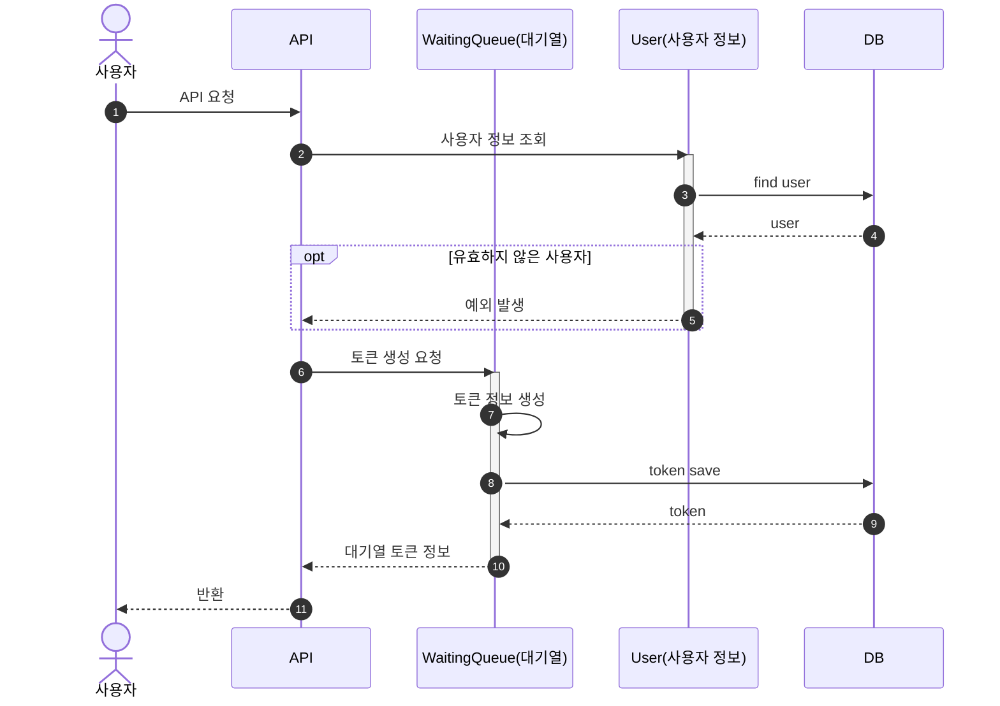
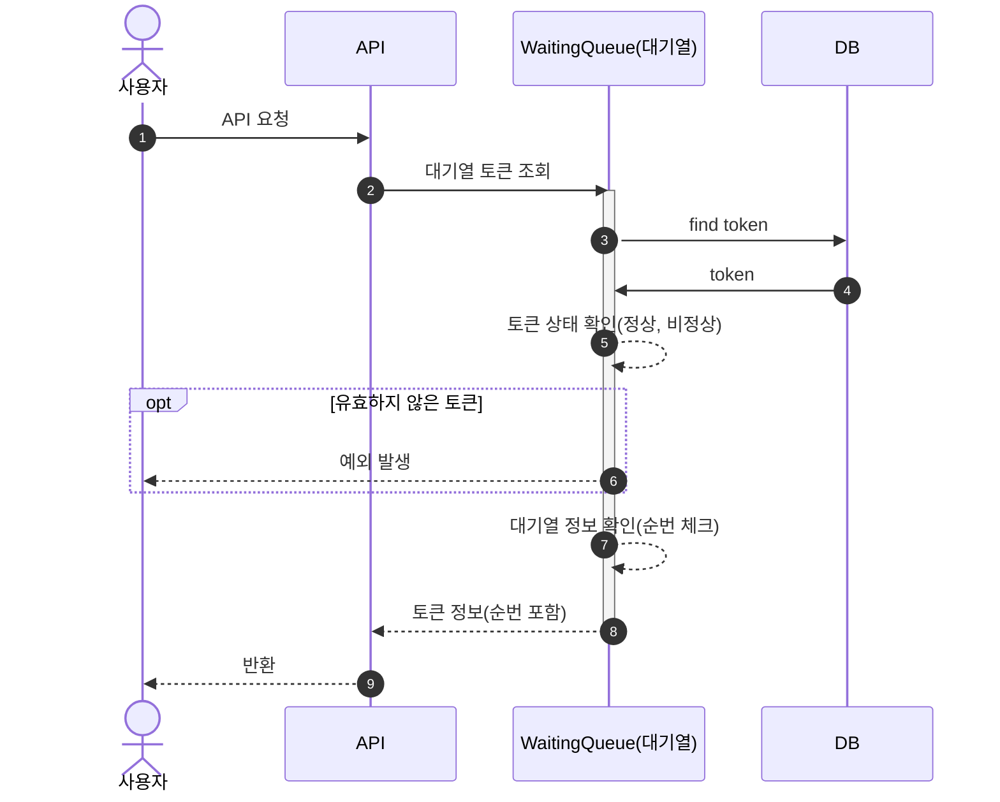
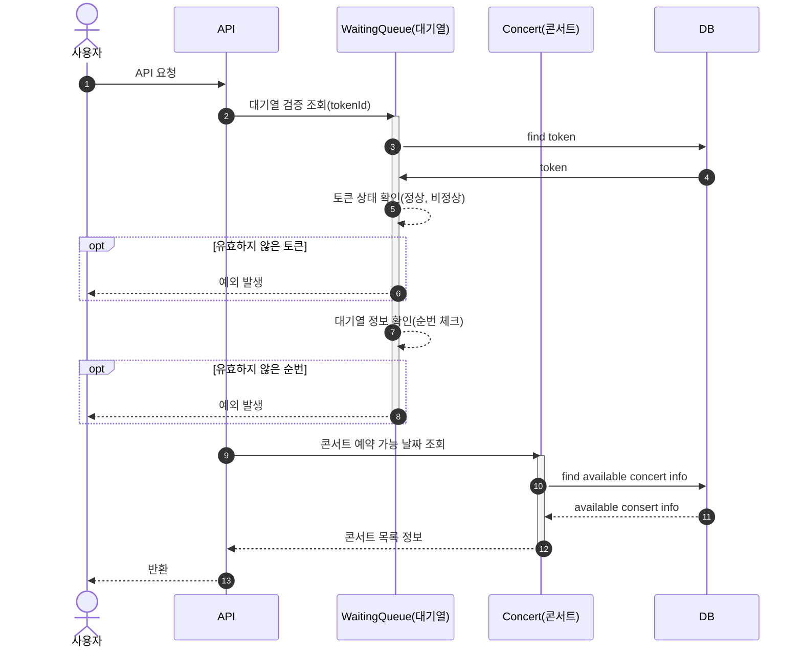
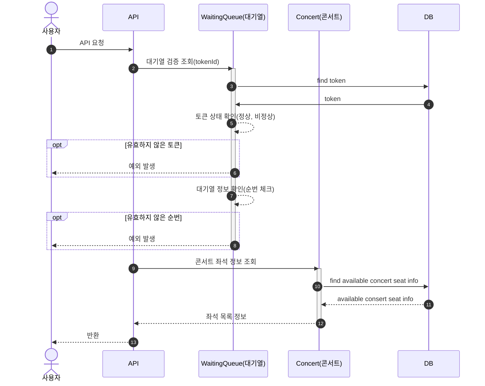
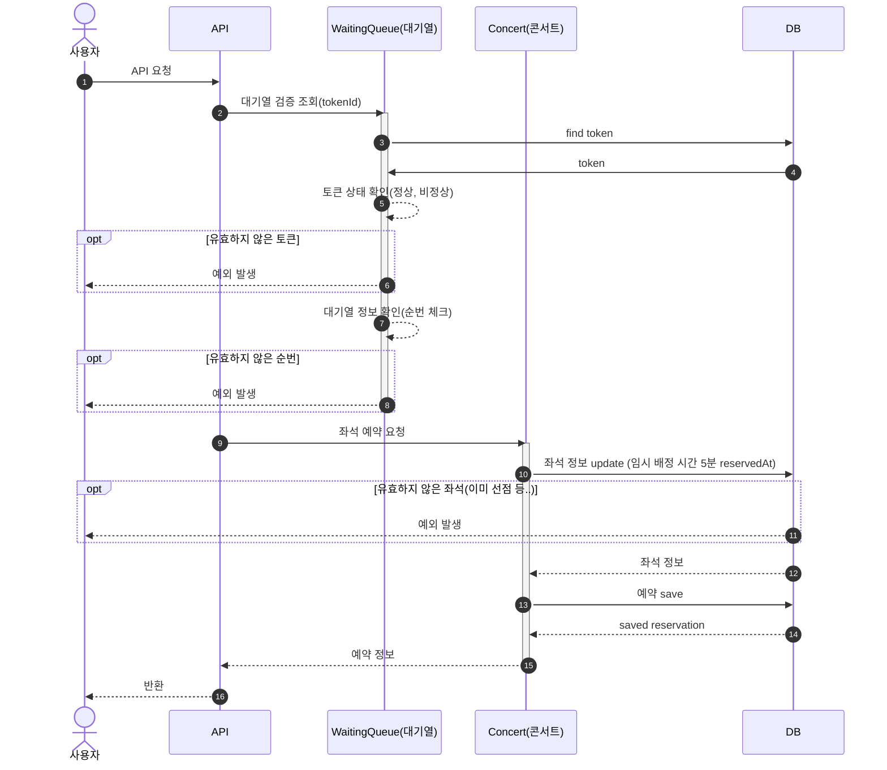
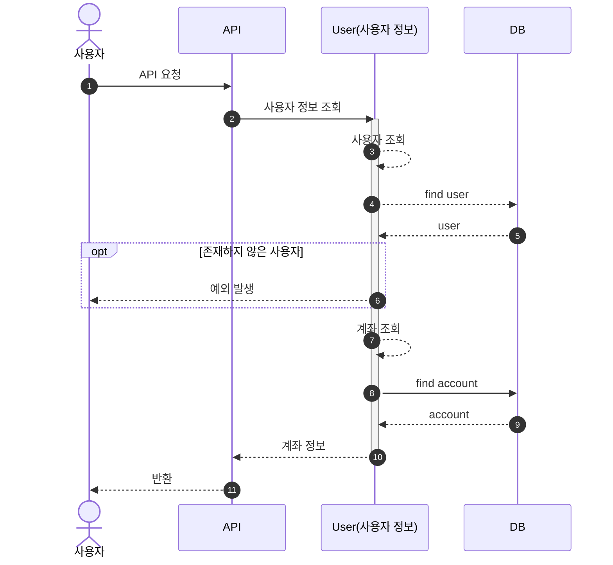
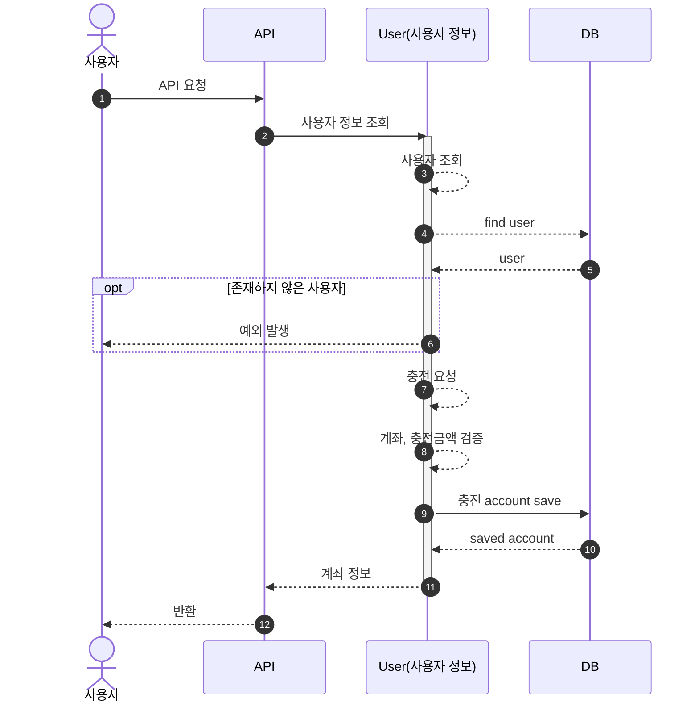
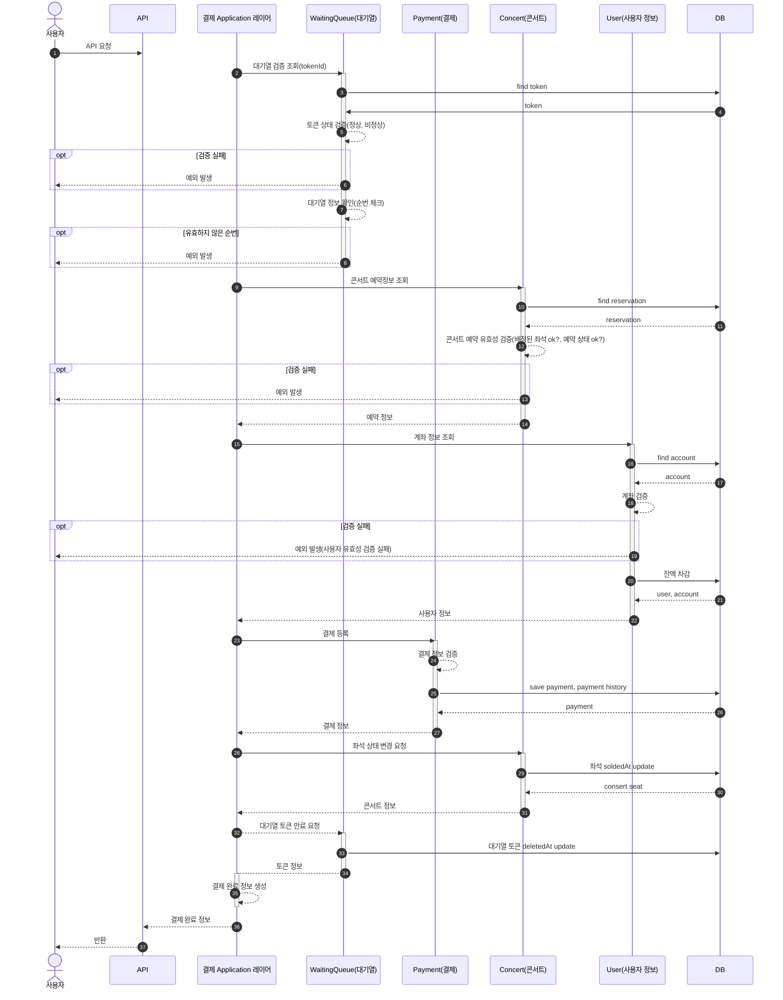

## 콘서트 예약 시스템

### 대기열 토큰 발급 API

```mermaid
sequenceDiagram
    autonumber
Actor U as 사용자
participant API as API
participant WS as WaitingQueue(대기열)
participant US as User(사용자 정보)
participant DB as DB

U->>API: API 요청
API->>US: 사용자 정보 조회
activate US
US->>DB: find user
DB-->>US: user
opt 유효하지 않은 사용자
	US-->>API: 예외 발생
end
deactivate US
API->>WS: 토큰 생성 요청
activate WS
WS->>WS: 토큰 정보 생성
WS->>DB: token save
DB-->>WS: token
WS-->>API: 대기열 토큰 정보 
deactivate WS
API-->>U: 반환
```

### 대기열 상태 조회 polling API

```mermaid
sequenceDiagram
autonumber
Actor U as 사용자
participant API as API
participant WS as WaitingQueue(대기열)
participant DB as DB

U->>API: API 요청
API->>WS: 대기열 토큰 조회
activate WS
WS->>DB: find token
DB->>WS: token
WS-->>WS: 토큰 상태 확인(정상, 비정상)
opt 유효하지 않은 토큰
WS-->>U: 예외 발생
end
WS-->>WS: 대기열 정보 확인(순번 체크)
WS-->>API: 토큰 정보(순번 포함)
deactivate WS
API-->>U: 반환
```

### 예약 가능 날짜 조회 API

```mermaid
%% 예약 가능 날짜
sequenceDiagram
autonumber
Actor U as 사용자
participant API as API
participant WS as WaitingQueue(대기열)
participant CS as Concert(콘서트)
participant DB as DB

U->>API: API 요청
API->>WS: 대기열 검증 조회(tokenId)
activate WS
WS->>DB: find token
DB->>WS: token
WS-->>WS: 토큰 상태 확인(정상, 비정상)
opt 유효하지 않은 토큰
WS-->>U: 예외 발생
end
WS-->>WS: 대기열 정보 확인(순번 체크)
opt 유효하지 않은 순번
WS-->>U: 예외 발생
end
deactivate WS
API->>CS: 콘서트 예약 가능 날짜 조회
activate CS
CS->>DB: find available concert info
DB-->>CS: available consert info
CS-->>API: 콘서트 목록 정보
deactivate CS
API-->>U: 반환
```

### 예약 가능 좌석 조회 API

```mermaid
%% 예약 가능 날짜 / 좌석 요청
sequenceDiagram
autonumber
Actor U as 사용자
participant API as API
participant WS as WaitingQueue(대기열)
participant CS as Concert(콘서트)
participant DB as DB

U->>API: API 요청
API->>WS: 대기열 검증 조회(tokenId)
activate WS
WS->>DB: find token
DB->>WS: token
WS-->>WS: 토큰 상태 확인(정상, 비정상)
opt 유효하지 않은 토큰
WS-->>U: 예외 발생
end
WS-->>WS: 대기열 정보 확인(순번 체크)
opt 유효하지 않은 순번
WS-->>U: 예외 발생
end
deactivate WS
API->>CS: 콘서트 좌석 정보 조회
activate CS
CS->>DB: find available concert seat info
DB-->>CS: available consert seat info
CS-->>API: 좌석 목록 정보
deactivate CS
API-->>U: 반환
```

### 좌석 예약 요청 API

```mermaid
%% 예약 요청
sequenceDiagram
autonumber
Actor U as 사용자
participant API as API
participant WS as WaitingQueue(대기열)
participant CS as Concert(콘서트)
participant DB as DB

U->>API: API 요청
API->>WS: 대기열 검증 조회(tokenId)
activate WS
WS->>DB: find token
DB->>WS: token
WS-->>WS: 토큰 상태 확인(정상, 비정상)
opt 유효하지 않은 토큰
WS-->>U: 예외 발생
end
WS-->>WS: 대기열 정보 확인(순번 체크)
opt 유효하지 않은 순번
WS-->>U: 예외 발생
end
deactivate WS
API->>CS: 좌석 예약 요청
activate CS
CS->>DB: 좌석 정보 update (임시 배정 시간 5분 reservedAt)
opt 유효하지 않은 좌석(이미 선점 등..)
DB-->>U: 예외 발생
end
DB-->>CS: 좌석 정보
CS->>DB: 예약 save
DB-->>CS: saved reservation
CS-->>API: 예약 정보
deactivate CS
API-->>U: 반환
```

### 잔액 조회 API

```mermaid
%% 잔액 조회 API
sequenceDiagram
autonumber
Actor U as 사용자
participant API as API
participant US as User(사용자 정보)
participant DB as DB

U->>API: API 요청
API->>US: 사용자 정보 조회
activate US
US-->>US: 사용자 조회
US-->>DB: find user
DB-->>US: user
opt 존재하지 않은 사용자
US-->>U: 예외 발생
end
US-->>US: 계좌 조회
US->>DB: find account
DB-->>US: account
US-->>API: 계좌 정보
deactivate US
API-->>U: 반환
```

### 잔액 충전 API

```mermaid
%% 잔액 충전
sequenceDiagram
autonumber
Actor U as 사용자
participant API as API
participant US as User(사용자 정보)
participant DB as DB

U->>API: API 요청
API->>US: 사용자 정보 조회
activate US
US-->>US: 사용자 조회
US-->>DB: find user
DB-->>US: user
opt 존재하지 않은 사용자
US-->>U: 예외 발생
end
US-->>US: 충전 요청
US-->>US: 계좌, 충전금액 검증
US->>DB: 충전 account save
DB-->>US: saved account
US-->>API: 계좌 정보
deactivate US
API-->>U: 반환
```

### 결제 API

```mermaid
%% 결제 API
sequenceDiagram
autonumber
Actor U as 사용자
participant API as API
participant PA as 결제 Application 레이어
participant WS as WaitingQueue(대기열)
participant PS as Payment(결제)
participant CS as Concert(콘서트)
participant US as User(사용자 정보)
participant DB as DB

U->>API: API 요청
PA->>WS: 대기열 검증 조회(tokenId)
activate WS
WS->>DB: find token
DB->>WS: token
WS-->>WS: 토큰 상태 검증(정상, 비정상)
opt 검증 실패
WS-->>U: 예외 발생
end
WS-->>WS: 대기열 정보 확인(순번 체크)
opt 유효하지 않은 순번
WS-->>U: 예외 발생
end
deactivate WS

PA->>CS: 콘서트 예약정보 조회
activate CS
CS->>DB: find reservation
DB-->>CS: reservation
CS-->>CS: 콘서트 예약 유효성 검증(배정된 좌석 ok?, 예약 상태 ok?)
opt 검증 실패
CS-->>U: 예외 발생
end
CS-->>PA: 예약 정보
deactivate CS
PA->>US: 계좌 정보 조회
activate US
US->>DB: find account
DB-->>US: account
US-->>US: 계좌 검증
opt 검증 실패
US-->>U: 예외 발생(사용자 유효성 검증 실패)
end
US->>DB: 잔액 차감
DB-->>US: user, account
US-->>PA: 사용자 정보
deactivate US
PA->>PS: 결제 등록
activate PS
PS-->>PS: 결제 정보 검증
PS->>DB: save payment, payment history
DB-->>PS: payment
PS-->>PA: 결제 정보
deactivate PS
PA->>CS: 좌석 상태 변경 요청
activate CS
CS->>DB: 좌석 soldedAt update
DB-->>CS: consert seat
CS-->>PA: 콘서트 정보
deactivate CS
PA-->>WS: 대기열 토큰 만료 요청
activate WS
WS->>DB: 대기열 토큰 deletedAt update
WS-->PA: 토큰 정보
deactivate WS
activate PA
PA-->>PA: 결제 완료 정보 생성
deactivate PA
PA-->>API: 결제 완료 정보
API-->>U: 반환
```