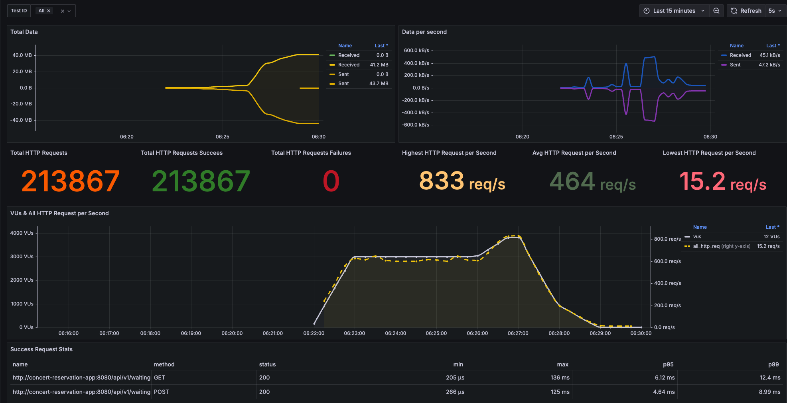

### 다양한 성능 지표 분석 (가상) 장애 대응 보고서

대기열 토큰 발급 및 폴링에 대해 다음과 같은 시나리오를 만들어봤다.
대기열이 소모되는 양보다 발급되는 양이 더 많아지면 어떻게 될까?

```javascript
scenarios: {
        s2: {
            exec: 'user_waiting_tokens_process',
            executor: 'ramping-vus',
            startVUs: 0,
            stages: [
                { duration: '1m', target: 3000 }, // 1분 동안 3000명으로 증가
                { duration: '3m', target: 3000 }, // 3분 동안 3000명으로 유지
                { duration: '1m', target: 4000 }, // 1분 동안 4000으로 증가
                { duration: '1m', target: 1000 }, // 1분 동안 1000으로 감소
                { duration: '1m', target: 0 }, // 마지막 1분 동안 0으로 감소
            ],
            gracefulStop: '0s',
            gracefulRampDown: '0s',
            tags: { scenario: 's2' },
        },
    },
```



### 장애 포인트 분석
토큰 발급량이 대기열 소모량보다 많아질 경우 다음과 같은 장애 포인트가 발생할 수 있다.

* 대기열 증가 및 지연 발생
설명: 토큰 발급 속도가 소비 속도보다 빠를 경우 대기열에 토큰이 쌓이게 된다.. 이로 인해 대기열 길이가 비정상적으로 증가하면서 응답 지연이 발생할 수 있다.
이는 사용자 경험을 저하시키고 서비스의 신뢰성을 떨어뜨릴 수 있다.

* 시스템 자원 고갈
대기열이 지속적으로 증가하면 그만큼 대기열 관련해 레디스 호출빈도가 늘어닐 것이고 메모리, 스토리지 등의 레디스 자원에 악영향이 발생할 수 있다.
만약에 대기열 전용 레디스가 아니라면 다른 서비스에도 영향을 줄 수 있다.

* VUs 증가로 인한 네트워크 병목 현상
설명: VUs가 급격히 증가할 경우 결국 애플리케이션과 서버, 인프라 간의 네트워크 트래픽이 증가하게 되고 이를 서비스 지연 및 장애로 이어질 수 있다.

### 장애 대응 방안

* 대기열 모니터링 및 알림 설정
대기열 길이, 대기 시간 등을 실시간으로 모니터링하고, 임계값 초과 시 알림을 설정하여 신속히 대응할 수 있도록 한다면 좀 더 빠른 대응이 가능할 것이다.

* 토큰 발급 속도 제어
일정 인원 이상의 대기열이 발생할 경우 토큰 발급 속도를 제어하여 소비 속도와 적절한 균형을 맞추도록 제한한다면 대기열에 대한 장애를 최소화할 수 있다.

* 특정 장애 서비스에 대한 접근 제한
장애 발생 시 해당 서비스에 대한 접근을 서킷브레이커 패턴을 통해 제한하여 문제 되는 서비스 안으로 장애 범위를 좁힐 수 있고 연쇄 장애 발생을 막을 수 있다.


### 결론
예상 장애를 생각해보고 그에 대한 대응 방안들을 적다보니 느낀 부분이 있다.
예상 사용자 수를 파악하고 분석이 잘되어있으면 그에 맞는 적절한 서비스가 설계될 것이라는 것이다.
또한 확장성 있게 설계해야 서비스 가용성을 높일 수 있다는 것. 무엇보다도 도메인 별로 지점이 잘 나눠져있다면
문제가 생겼을 때 그부분에 대한 부하만 생길 가능성이 높고 복구에 있어서 좀 더 수월할 것이라는 생각이 들었다.


