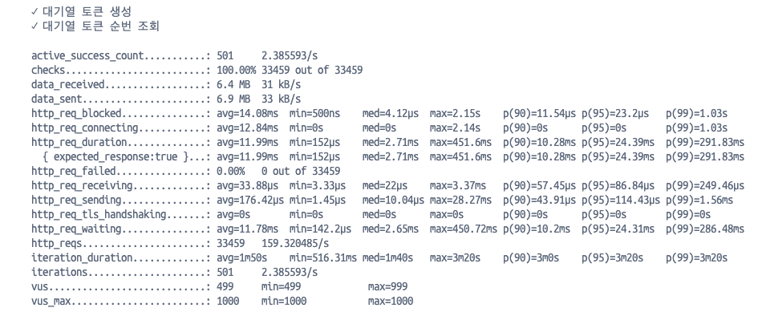
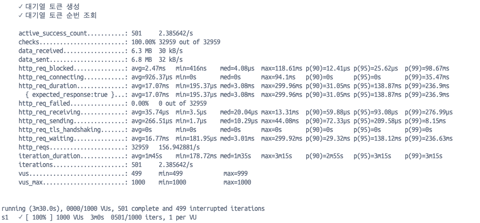
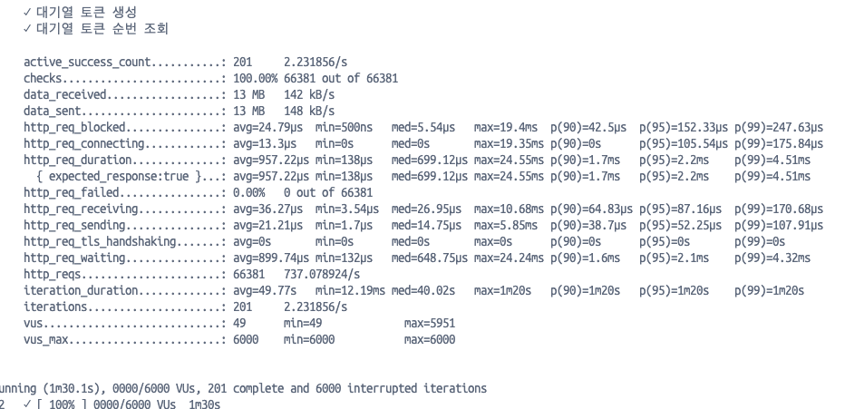
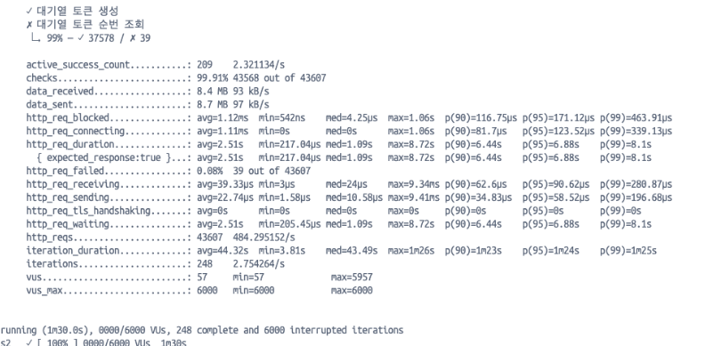
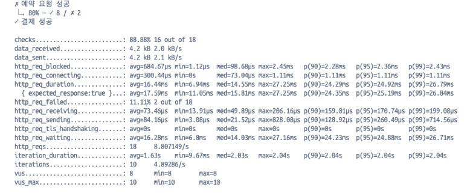
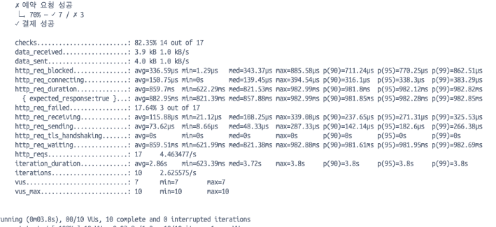

### 부하 테스트 대상 선정 및 목적

시스템에 부하를 주는 요소는 다양하다. 시스템 자원, 비효율적인 코드 설계, 대규모 사용자 등이 이에 해당할 수 있습니다. 이 중 가장 중요한 부분은 결국 **사용자**입니다. 얼마나 많은 사용자가 시스템을 이용하는지에 따라 자원을 조절해야 하며, 사용자가 적을 때는 문제가 없었던 코드도 문제가 생길 수 있다.

이러한 이유로, 부하 테스트 대상을 선정할 때 일정 시간 동안 사용자가 어떤 기능을 수행하는지에 초점을 맞추어 아래와 같이 테스트 시나리오를 선정했다.

- **대기열 토큰 발급 → 대기열 토큰 상태 조회 프로세스**
- **스케줄 좌석 예약 → 결제 완료 프로세스**

---

### 부하 테스트 환경

* 성능 저하에 대한 설정
    * spring application :  "-Xms128m -Xmx256m -XX:+UseSerialGC"
    * docker spec:
        * 사용 자원: 최대 1개 cpu, 메모리 1g,
        * 실행시 예약 자원: 최소 0.5개 , 메모리 1g


-------------------


## **대기열 토큰 발급 → 대기열 토큰 상태 조회 프로세스**

### 테스트 시나리오

#### S1: 순간적인 부하 테스트

- **목표:** 대기열이 오픈되자마자 발생하는 순간 부하 확인
- **설정:** 1000명의 사용자가 동시에 호출
- **시나리오 실행 시간:** 3분

```javascript
scenarios: {  
    s1: {  
        exec: 'user_waiting_tokens_process',  
        executor: 'per-vu-iterations',  
        vus: 1000,  
        iterations: 1,  
        maxDuration: '3m',  
        tags: { scenario: 's1' },  
    },  
},
```

#### 시나리오 플로우

1. **대기열 토큰 생성**
2. 각 사용자는 자신의 대기열 순번을 5초마다 polling
3. 대기열 활성화 스케줄러가 20초 간격으로 50명씩 대기열 → 활성화 토큰으로 변경
4. 활성화 토큰 확인 시 작업 종료

---

### **테스트 결과 (S1)**

- **총 시나리오 실행 시간:** 3분 30초
- **활성화 성공 사용자 수:** 501명
    - 20초 간격 스케줄러 실행 횟수: 약 9~10회 → 예상치와 일치




#### HTTP 요청 시간 항목

|**메트릭**|**평균**|**상위 5% 지연**|
|---|---|---|
|**`http_req_blocked`**|2.47ms|`p(90)=12.41µs`, `p(95)=25.62µs`|
|**`http_req_connecting`**|926.37µs|-|
|**`http_req_duration`**|17.07ms|`p(90)=31.05ms`, `p(95)=138.87ms`|
|**`http_req_waiting`**|16.77ms|-|

#### 성능 개선 후 결과




**주요 성능 차이 비교**

|**항목**|**개선 전**|**개선 후**|**변화**|
|---|---|---|---|
|**요청 처리 시간**||||
|평균|17.07ms|11.99ms|**약 30% 감소**|
|p(90)|31.05ms|10.28ms|**약 67% 감소**|
|p(95)|138.87ms|24.39ms|**약 82% 감소**|
|**데이터 처리량**||||
|data_received|6.3MB|6.4MB|**0.1MB 증가**|
|data_sent|6.8MB|6.9MB|**0.1MB 증가**|
|**요청 속도**||||
|http_reqs|32,959 (156.94/s)|33,459 (159.32/s)|**초당 요청 수 약 1.5% 증가**|

---

#### S2: Ramping VU 테스트

- **목표:** 사용자 증가 패턴에 따른 시스템 반응 확인
- **시나리오 설정**
    1. **20초:** 0 → 5000명 증가
    2. **10초:** 5000 → 6000명 증가
    3. **1분:** 6000 → 0명 감소

```javascript
scenarios: {  
    s2: {  
        exec: 'user_waiting_tokens_process',  
        executor: 'ramping-vus',  
        startVUs: 0,  
        stages: [  
            { duration: '20s', target: 5000 },  
            { duration: '10s', target: 6000 },  
            { duration: '1m', target: 0 },  
        ],  
        gracefulStop: '0s',  
        gracefulRampDown: '0s',  
        tags: { scenario: 's2' },  
    },  
},
```

---

### **테스트 결과 (S2)**



#### 처리 성능

|**메트릭**|**값**|
|---|---|
|**`http_req_duration`**|평균: **957.22µs**, 최대: **24.55ms**|
|**`http_req_waiting`**|평균: **899.74µs**|
|**`http_req_sending`**|평균: **21.21µs**|
|**`http_req_receiving`**|평균: **36.27µs**|
|**요청 수 (`http_reqs`)**|**66,381 (737.08/s)**|
|**총 반복 수 (`iterations`)**|**201 (2.23/s)**|

#### 성능 저하 환경 및 비교



|**항목**|**정상 환경**|**저하 환경**|**변화**|
|---|---|---|---|
|평균 응답 시간 (`http_req_duration.avg`)|957.22µs|2.51s|**약 262배 증가**|
|P90 응답 시간|1.7ms|6.44s|**약 3788배 증가**|
|P95 응답 시간|2.2ms|6.88s|**약 3127배 증가**|
|최대 응답 시간|24.55ms|8.72s|**355배 증가**|
|HTTP 실패율 (`http_req_failed`)|0.00%|0.08%|**실패율 증가**|
|요청 수|66,381|43,607|**34.4% 감소**|

---

## **스케줄 좌석 예약 → 결제 완료 프로세스**

- 대기열과 달리 활성화된 토큰을 가진 사용자 간의 경쟁이므로, VUs를 10명으로 설정
- **시나리오 설정:** 최대 10명이 동시에 좌석 예약 및 결제 시도



#### 성능 저하


#### 비교

|**항목**|**정상 환경**|**저하 환경**|**변화**|
|---|---|---|---|
|예약 성공률|80~88%|70%|**약 10~18% 감소**|
|결제 성공률|100%|70%|**30% 감소**|
|평균 응답 시간|66.44ms|859.7ms|**약 13배 증가**|
|최대 응답 시간|27.25ms|982.99ms|**약 36배 증가**|
|P90 응답 시간|24.29ms|981.85ms|**약 40배 증가**|
|P95 응답 시간|25.19ms|982.12ms|**약 40배 증가**|
|HTTP 실패율|11.11%|17.64%|**약 6.5% 증가**|
|요청 처리량|4.89 요청/초|2.62 요청/초|**약 46% 감소**|

---

### 결론 및 회고

이번 부하 테스트를 통해 시스템의 현재 성능 상태에 따른 부하 테스트 차이를 알 수 있었다. 이러한 테스트 지표를 통해 개선점을 찾고 서비스 안정성 및 성능을 높일 수 있을 것 같았다.

이번 k6를 통한 부하테스트는 가장 어려웠던 과제가 아닐까 싶다. 다른 것은 코드만 작정하면되는데 이건 익숙하지 않은 자바스크립트 기반 서비스이어서 좀 이것 저것 안되는 부분도 많았고 난관이 있었다. 그래도 하나씩 해결하면서 결국 로컬에서 직접 실행하던 infra를 전부 도커로 전환해 띄우면서 큰 성취감도 느꼈다.
특히 이렇게 하니 나만의 테스트 환경을 구성할 수 있는 좋은 계기였다.
